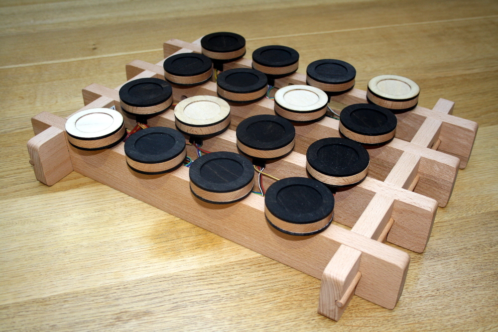
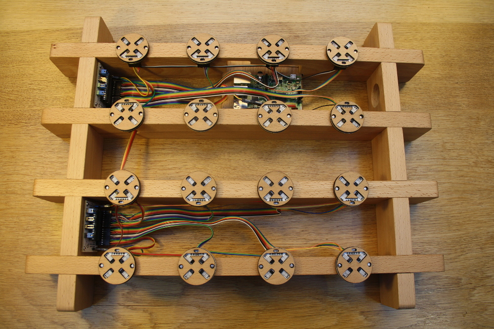
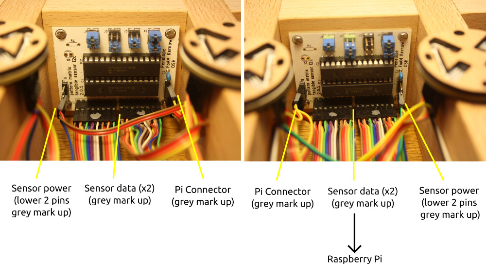
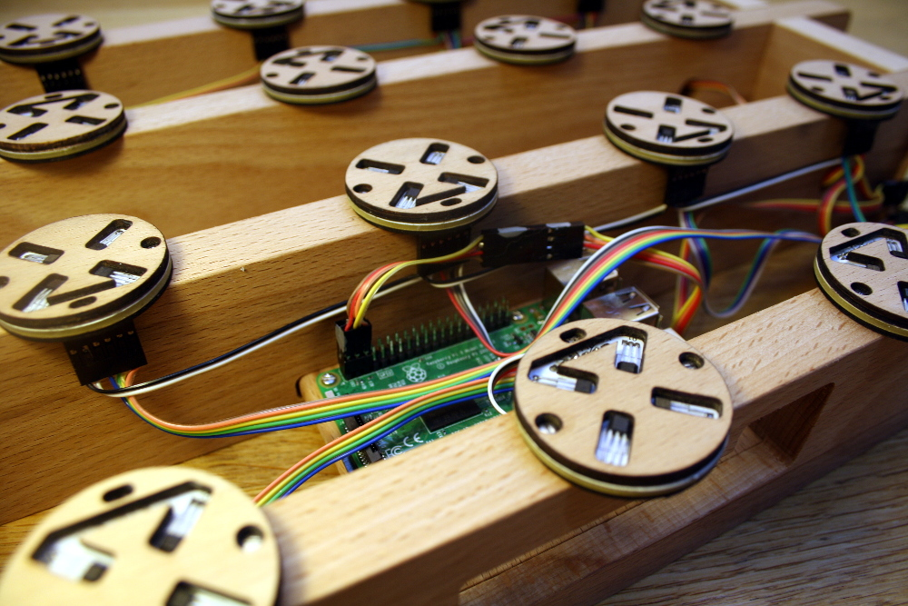
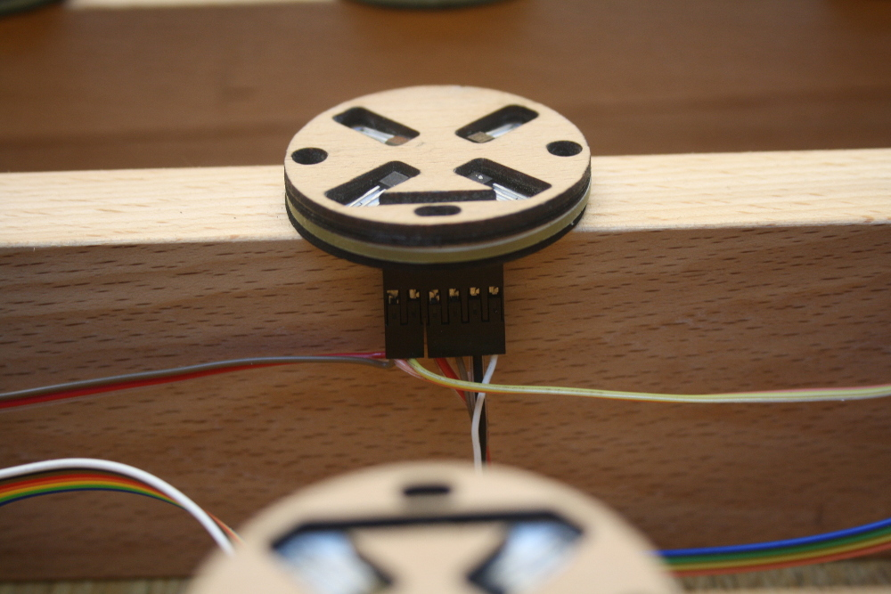
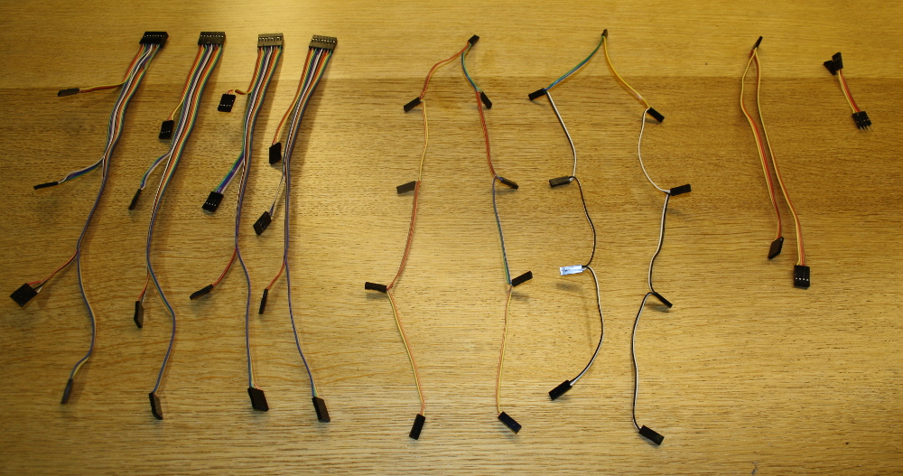

# Pattern Matrix Tangible Weavecoding manual (4X4 v3.0)

This version comprises both warp weighted mode and an experimental
tablet weaving mode and a new web control panel that can be used via
wifi on a laptop or phone (it uses it's own local network no internet
connectivity is required).

On startup the warp weighted loom mode activates with a 4x4
matrix. The circular blocks operate digital control and the square one
controls the the yarn colour pattern. (There is no special 'shutdown'
token any more.)

## Web control panel

Connect via wifi to `patternmatrix` password: `penelopeundo`

Once connected visit this URL: [http://10.42.0.1/](http://10.42.0.1/). 
You should see a web page in your browser like this:

From here you can remotely switch loom types and shutdown or restart
the Pi. Note: while connected to the pattern matrix, you will not be
able to reach the internet.

## Putting it together

The two pairs of sensor rows are connected together via the power
cables (be careful when unpacking). The Raspberry Pi shelf needs to be
slotted into the top two with the large opening outwards so power and
HDMI cables can be plugged in. The two poles are inserted to lock
everything in place.

## Connections

Overall picture – the Raspberry Pi connects to the two “row
controller” boards via a 4 way ribbon cable. Each “row controller”
supplies power to it's 8 sensor boards via a 2 way ribbon cable and
reads the sensor data via the large 16 way ribbon cable that plugs
into each sensor. 

The connectors on the sensor end are left plugged in, but the other
ends need connecting to the row controllers. This can be easier to do
by turning the pattern matrix upside down. Blobs of grey nail varnish
indicate the side of the plug that should be facing up:

The row controllers need connecting to the Raspberry Pi via the 4 way
ribbon cable:

## More detailed information
   
If the sensors need to be disconnected at any time, they are
reconnected like this, with the power on the left two pins and the
data on the right four pins - with the metal parts outward facing.

These are the four types of connector, from left to right: four sensor
data connectors, two sensor power connectors and two connectors that
connect the Raspberry Pi to the row controllers.

